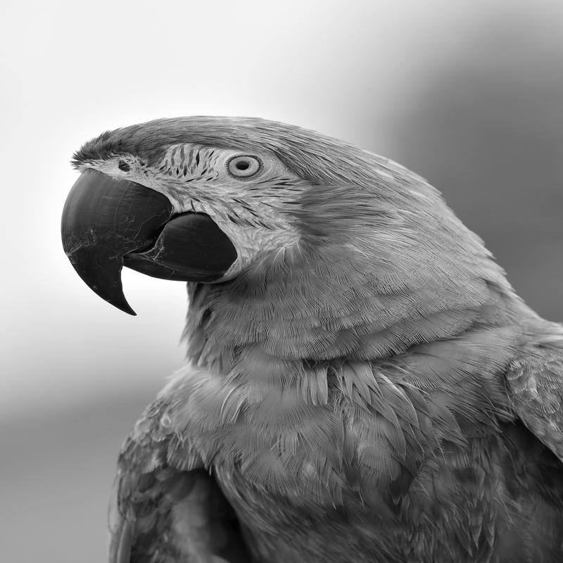

# 🖼️ Image Batch Editor (Python)

This project is a Python-based image batch editor built using PIL (Pillow). It allows users to apply multiple operations to images in bulk.

## 🚀 Features
- Resize images (with/without aspect ratio)
- Convert to grayscale
- Rotate images
- Add watermark text
- Convert image formats (JPG, PNG, BMP)
- Crop images
- Undo changes (restore original images)

## 🛠️ Tech Used
- Python
- PIL (Pillow)

## ▶️ How to Run
```bash
python main.py
## 📸 Demo



